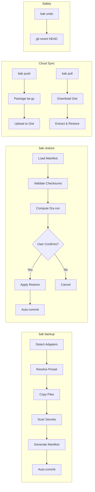
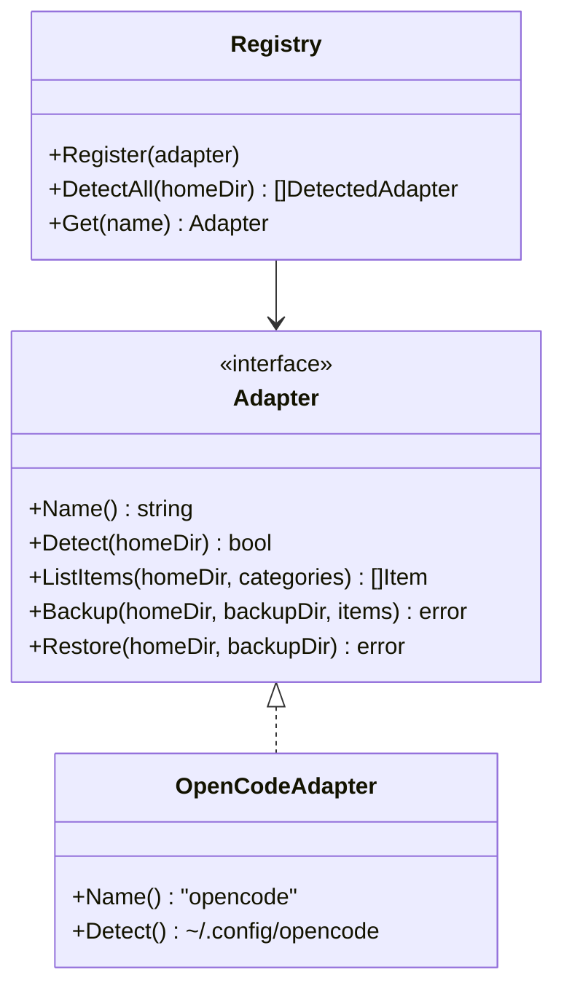

# bak — Backup Your AI Coding Setup

[](https://goreportcard.com/report/github.com/danielxxomg/bak-cli)
[](https://opensource.org/licenses/MIT)
[](https://github.com/danielxxomg/bak-cli/releases/latest)

**bak** is a CLI tool that backs up, restores, and syncs your OpenCode AI coding configuration across machines. Never lose your skills, MCP servers, plugins, agents, or config files again.

## Features

- 🔄 **Backup & Restore** — Preset-based backups (quick, full, skills) with mandatory dry-run before restore
- 🔒 **Secret Detection** — Automatically excludes API keys, tokens, and generates `.env.example` templates
- ☁️ **Cloud Sync** — Push/pull backups to private GitHub Gists
- 🖥️ **Cross-Platform** — Works on Windows, macOS, and Linux with path normalization
- 🎯 **Interactive Picker** — TUI with bubbletea for selective category backup
- ↩️ **Undo** — Git-backed safety with `bak undo` (git revert)
- 📦 **Export** — Export backups as portable tar.gz archives

## Installation

### From Source

```bash
git clone https://github.com/danielxxomg/bak-cli.git
cd bak-cli
go build -o bak .
```

### With Go

```bash
go install github.com/danielxxomg/bak-cli@latest
```

### Pre-built Binaries

Download from [GitHub Releases](https://github.com/danielxxomg/bak-cli/releases).

## Quick Start

```bash
# Create a backup
bak backup

# Preview what would be restored
bak restore --dry-run 20260604-150405

# Restore a backup
bak restore 20260604-150405

# Undo the last restore
bak undo

# Sync to GitHub
bak login
bak push
bak pull
```

## Commands

| Command | Description |
|---------|-------------|
| `bak backup [--preset quick\|full\|skills]` | Create a backup |
| `bak restore [--dry-run] [--force] <id>` | Restore a backup |
| `bak undo` | Revert the last operation |
| `bak list` | List all local backups |
| `bak pick` | Interactive TUI picker |
| `bak push [id]` | Push to GitHub Gist |
| `bak pull [id]` | Pull from GitHub Gist |
| `bak export <id> [--output path]` | Export as tar.gz |
| `bak login` | Authenticate with GitHub |
| `bak version` | Show version info |

## Configuration

### Storage Location

Backups are stored in `~/.bak/backups/<id>/`:

```
~/.bak/
├── config.json          # bak configuration
└── backups/
    └── 20260604-150405/
        ├── manifest.json
        ├── .env.example
        └── opencode/
            ├── skills/
            ├── commands/
            ├── plugins/
            └── config files...
```

### GitHub Token

For cloud sync, configure a GitHub token:

```bash
# Option 1: Interactive
bak login

# Option 2: Environment variable
export GITHUB_TOKEN=ghp_xxxxxxxxxxxx

# Option 3: Config file
bak config set github.token ghp_xxxxxxxxxxxx
```

## Architecture

```
bak-cli/
├── cmd/                    # CLI commands (cobra)
├── internal/
│   ├── adapters/           # Agent adapters (OpenCode first-class)
│   ├── backup/             # Backup engine + presets + secrets
│   ├── restore/            # Restore engine + dry-run + git safety
│   ├── manifest/           # Manifest schema + validation
│   ├── cloud/              # GitHub Gist client
│   ├── paths/              # Cross-platform path normalization
│   ├── git/                # Git operations (go-git)
│   ├── config/             # Configuration management
│   └── presets/            # Preset definitions
├── .goreleaser.yaml        # Cross-platform release config
└── Makefile                # Development workflow
```

### Data Flow



### Adapter Pattern



## Safety Guarantees

- ✅ **Mandatory dry-run** — Always preview changes before restore
- ✅ **Git-backed safety** — Auto-commit before/after restore
- ✅ **Instant rollback** — `bak undo` reverts in one command
- ✅ **Secret exclusion** — API keys/tokens never backed up
- ✅ **Path validation** — Prevents path traversal attacks
- ✅ **Checksum verification** — SHA-256 integrity checks

## Contributing

1. Fork the repository
2. Create a feature branch (`git checkout -b feature/amazing-feature`)
3. Commit your changes (`git commit -m 'feat: add amazing feature'`)
4. Push to the branch (`git push origin feature/amazing-feature`)
5. Open a Pull Request

### Adding a New Adapter

Implement the `Adapter` interface:

```go
type Adapter interface {
    Name() string
    Detect(homeDir string) (bool, string, error)
    ListItems(homeDir string, categories []string) ([]Item, error)
    Backup(homeDir, backupDir string, items []Item) error
    Restore(homeDir, backupDir string) error
}
```

Register it in `cmd/backup.go`:

```go
reg := adapters.NewRegistry()
reg.Register(&youradapter.Adapter{})
```

## Roadmap

### v1.1 (planned)
- [ ] Increase test coverage for `cmd` package (currently 23.6%)
- [ ] Increase test coverage for `internal/config` (currently 68.3%)
- [ ] Logo and banner image
- [ ] GitHub Actions release workflow (goreleaser)

### v2.0 (future)
- [ ] **Multi-agent support** — Cursor, Claude Code, Codex, Windsurf, Kiro, pi.dev, KiloCode
- [ ] **Cloud backends** — GitHub private repo, Codeberg, rclone (Google Drive, OneDrive, S3), Gitea/Forgejo
- [ ] **Encryption at rest** — Optional encryption for sensitive backups
- [ ] **Machine-specific profiles** — `bak profile create work-laptop`, `bak profile create home-pc`
- [ ] **GUI** — Optional terminal UI with bubbletea (beyond `bak pick`)

### v2.x (long-term)
- [ ] Backup scheduling (cron integration)
- [ ] Diff between backups (`bak diff <id1> <id2>`)
- [ ] Backup verification (`bak verify <id>`)
- [ ] Plugin system for custom backup strategies

## License

MIT License — see [LICENSE](LICENSE) for details.
