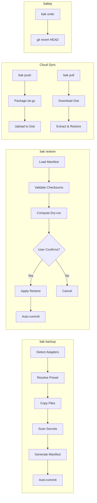
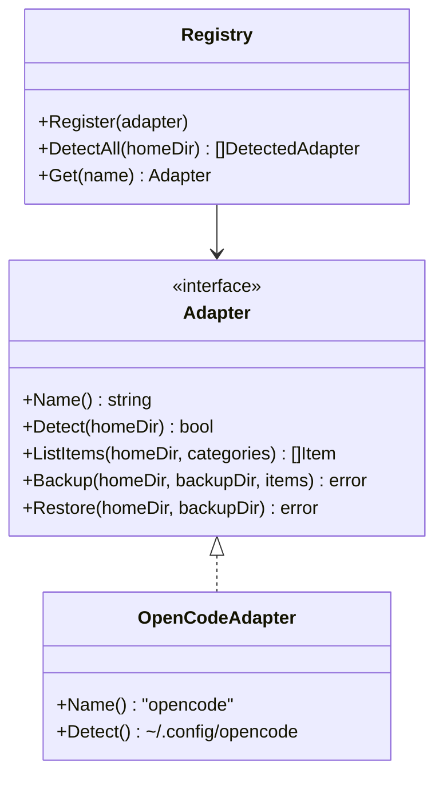

<p align="center">
  
</p>

<p align="center">
  <a href="https://goreportcard.com/report/github.com/danielxxomg/bak-cli"></a>
  <a href="https://opensource.org/licenses/MIT"></a>
  <a href="https://github.com/danielxxomg/bak-cli/releases/latest"></a>
</p>

<p align="center">
  <strong>bak</strong> is a CLI tool that backs up, restores, and syncs your AI coding configuration across machines. Supports Claude Code, Cursor, Codex, Windsurf, Kiro, KiloCode, pi.dev, and OpenCode. Never lose your skills, MCP servers, plugins, agents, or config files again.
</p>

## Features

- 🤖 **Multi-Agent Support** — Auto-detects 8 AI coding tools: Claude Code, Cursor, Codex, Windsurf, Kiro, KiloCode, pi.dev, and OpenCode
- 🔄 **Backup & Restore** — Preset-based backups (quick, full, skills) with mandatory dry-run before restore
- 🔒 **Secret Detection** — Automatically excludes API keys, tokens, and generates `.env.example` templates
- ☁️ **Multi-Cloud Sync** — Push/pull backups to GitHub Gist, GitHub Repo, Codeberg, Gitea/Forgejo, and rclone (Google Drive, S3, etc.)
- 🔐 **Encryption at Rest** — AES-256-GCM encryption with Argon2id key derivation; opt-in per profile
- 👤 **Machine Profiles** — `bak profile` commands to scope backups per machine with independent adapter, category, preset, provider, and encryption settings
- 🖥️ **Cross-Platform** — Works on Windows, macOS, and Linux with path normalization
- 🎯 **Interactive Picker** — TUI with bubbletea for selective category backup
- ↩️ **Undo** — Git-backed safety with `bak undo` (git revert)
- 📦 **Export** — Export backups as portable tar.gz archives

## Installation

### From Source

```bash
git clone https://github.com/danielxxomg/bak-cli.git
cd bak-cli
go build -o bak .
```

### With Go

```bash
go install github.com/danielxxomg/bak-cli@latest
```

### Pre-built Binaries

Download from [GitHub Releases](https://github.com/danielxxomg/bak-cli/releases).

## Quick Start

```bash
# Create a backup
bak backup

# Create a backup scoped to a machine profile
bak profile create work --provider github-gist --preset full --encrypt
bak backup --profile work

# Preview what would be restored
bak restore --dry-run 20260604-150405

# Restore a backup
bak restore 20260604-150405

# Undo the last restore
bak undo

# Sync to cloud (GitHub Gist, Codeberg, Gitea, rclone, etc.)
bak login
bak push --provider github-gist
bak pull
```

## Commands

| Command | Description |
|---------|-------------|
| `bak backup [--preset quick\|full\|skills] [--profile <name>]` | Create a backup |
| `bak restore [--dry-run] [--force] <id>` | Restore a backup |
| `bak undo` | Revert the last operation |
| `bak list [--provider <name>]` | List local or cloud backups |
| `bak pick` | Interactive TUI picker |
| `bak push [id] [--provider <name>] [--profile <name>]` | Push to a cloud backend |
| `bak pull [id] [--provider <name>] [--profile <name>]` | Pull from a cloud backend |
| `bak export <id> [--output path]` | Export as tar.gz |
| `bak login [--provider <name>]` | Authenticate with a cloud provider |
| `bak profile create\|list\|show\|delete` | Manage machine profiles |
| `bak version` | Show version info |

## Configuration

### Storage Location

Backups are stored in `~/.bak/backups/<id>/`:

```
~/.bak/
├── config.json          # bak configuration
└── backups/
    └── 20260604-150405/
        ├── manifest.json
        ├── .env.example
        └── opencode/
            ├── skills/
            ├── commands/
            ├── plugins/
            └── config files...
```

### GitHub Token

For cloud sync, configure a GitHub token:

```bash
# Option 1: Interactive (GitHub only)
bak login

# Option 2: Environment variable
export GITHUB_TOKEN=ghp_xxxxxxxxxxxx

# Option 3: Config file
bak config set github.token ghp_xxxxxxxxxxxx
```

### Cloud Providers

Use `--provider` to select a cloud backend for push/pull/list:

| Provider | Flag | Config Key | Env Token |
|----------|------|------------|-----------|
| GitHub Gist | `github-gist` (default) | `providers.github.token` | `GITHUB_TOKEN` |
| GitHub Repo | `github-repo` | `providers.github.token` + `.repo` | `GITHUB_TOKEN` |
| Codeberg | `codeberg` | `providers.codeberg.token` + `.repo` | `CODEBERG_TOKEN` |
| Gitea / Forgejo | `gitea` | `providers.gitea.token` + `.repo` + `.base_url` | `GITEA_TOKEN` |
| Rclone | `rclone` | `providers.rclone.remote` | — |

```bash
# Push to a specific provider
bak push --provider codeberg

# List cloud backups
bak list --provider github-gist

# Configure non-GitHub providers
bak config set providers.codeberg.token <your-token>
bak config set providers.codeberg.repo owner/backups
```

### Machine Profiles

Profiles let you scope backups to specific machines with independent settings
for adapters, categories, preset, provider, and encryption.

```bash
# Create a profile for your work laptop
bak profile create work-laptop --provider github-gist --preset full --encrypt

# Create a lightweight profile for your home PC
bak profile create home-pc --provider github-repo --preset quick

# Create a profile that only backs up OpenCode and Cursor config
bak profile create dev-box --provider codeberg --adapters opencode,cursor --categories config,skills

# List all profiles
bak profile list

# Show full profile details
bak profile show work-laptop

# Delete a profile
bak profile delete old-machine
```

Use a profile with `--profile` on `backup`, `push`, or `pull`:

```bash
bak backup --profile work-laptop
bak push --profile work-laptop
bak pull --profile work-laptop
```

When `--profile` is set, its preset, categories, and adapter list override
the equivalent CLI flags.

### Encryption

Encryption is enabled per profile with the `--encrypt` flag on `bak profile create`.
Encrypted archives use **AES-256-GCM** with **Argon2id** key derivation (64 MB RAM,
3 iterations, 4 parallelism).

| Feature | Detail |
|---------|--------|
| Algorithm | AES-256-GCM |
| Key derivation | Argon2id (64 MB, 3 iter, 4 parallel) |
| Magic bytes | `BAK_ENC\x01` — instant detection without parsing |
| Password input | Interactive prompt (stdin) or `BAK_ENCRYPTION_PASSWORD` env var |
| Backward compat | Plaintext archives from v0.2.0 are detected and handled automatically |

**Push flow**: `bak push --profile work` encrypts the tar.gz archive before upload.
**Pull flow**: `bak pull` detects magic bytes, prompts for password, decrypts on the fly.

```bash
# Set password via environment variable (CI/scripts)
export BAK_ENCRYPTION_PASSWORD="your-secure-password"
bak push --profile work

# Or use interactive prompt (no env var set)
bak push --profile work
# → Enter encryption password: ********
```

Encryption metadata (algorithm, KDF, salt, nonce) is stored in the backup manifest
for auditability. The password itself is never persisted to disk.

### Supported AI Coding Agents

`bak backup` auto-detects installed agents in priority order:

| Agent | Path | Priority |
|-------|------|----------|
| Claude Code | `~/.claude/` | 1 |
| Cursor | `~/.cursor/` | 2 |
| Codex | `~/.codex/` | 3 |
| Windsurf | `~/.codeium/windsurf/` | 4 |
| Kiro | `~/.kiro/` | 5 |
| KiloCode | `~/.kilocode/` | 6 |
| pi.dev | `~/.pi/` | 7 |
| OpenCode | `~/.config/opencode/` | 8 |

Force a specific adapter:
```bash
bak backup --adapter cursor
```

## Architecture

```
bak-cli/
├── cmd/                    # CLI commands (cobra)
├── internal/
│   ├── adapters/           # Agent adapters (8 supported: Claude Code, Cursor, Codex,
│   │   │                   #   Windsurf, Kiro, KiloCode, pi.dev, OpenCode)
│   │   └── register/       # RegisterAll() wire-up
│   ├── backup/             # Backup engine + presets + secrets
│   ├── restore/            # Restore engine + dry-run + git safety
│   ├── manifest/           # Manifest schema + validation
│   ├── cloud/              # Cloud provider abstraction (GitHub Gist, GitHub Repo,
│   │                       #   Codeberg, Gitea/Forgejo, Rclone)
│   ├── crypto/             # AES-256-GCM encryption + Argon2id key derivation
│   ├── paths/              # Cross-platform path normalization
│   ├── git/                # Git operations (go-git)
│   ├── config/             # Configuration management + v0.1.0 → v0.3.0 migration
│   └── presets/            # Preset definitions
├── .goreleaser.yaml        # Cross-platform release config
└── Makefile                # Development workflow
```

### Data Flow



### Adapter Pattern



## Safety Guarantees

- ✅ **Mandatory dry-run** — Always preview changes before restore
- ✅ **Git-backed safety** — Auto-commit before/after restore
- ✅ **Instant rollback** — `bak undo` reverts in one command
- ✅ **Secret exclusion** — API keys/tokens never backed up
- ✅ **Path validation** — Prevents path traversal attacks
- ✅ **Checksum verification** — SHA-256 integrity checks

## Contributing

1. Fork the repository
2. Create a feature branch (`git checkout -b feature/amazing-feature`)
3. Commit your changes (`git commit -m 'feat: add amazing feature'`)
4. Push to the branch (`git push origin feature/amazing-feature`)
5. Open a Pull Request

### Adding a New Adapter

Implement the `Adapter` interface:

```go
type Adapter interface {
    Name() string
    Detect(homeDir string) (bool, string, error)
    ListItems(homeDir string, categories []string) ([]Item, error)
    Backup(homeDir, backupDir string, items []Item) error
    Restore(homeDir, backupDir string) error
}
```

Register it in `cmd/backup.go`:

```go
reg := adapters.NewRegistry()
reg.Register(&youradapter.Adapter{})
```

## Roadmap

### v0.2.0 ✅ (current)
- [x] Multi-agent support — Claude Code, Cursor, Codex, Windsurf, Kiro, pi.dev, KiloCode, OpenCode
- [x] Cloud backends — GitHub private repo, Codeberg, rclone (Google Drive, OneDrive, S3), Gitea/Forgejo
- [x] `--provider` flag on push/pull/list/login
- [x] Config migration v0.1.0 → v0.2.0 with auto-backup
- [x] Provider abstraction with `ProviderRegistry`
- [x] Logo and banner image — see `docs/brand/`
- [ ] GitHub Actions release workflow (goreleaser)

### v0.3.0 ✅ (current)
- [x] **Encryption at rest** — AES-256-GCM with Argon2id key derivation, opt-in per profile
- [x] **Machine-specific profiles** — `bak profile create work-laptop`, `bak profile create home-pc`
- [x] **Profile-scoped backups** — `bak backup --profile work` resolves preset, categories, and adapters
- [ ] **GUI** — Optional terminal UI with bubbletea (beyond `bak pick`)

### v1.0.0 (long-term)
- [ ] Backup scheduling (cron integration)
- [ ] Diff between backups (`bak diff <id1> <id2>`)
- [ ] Backup verification (`bak verify <id>`)
- [ ] Plugin system for custom backup strategies

## Brand Assets

Visual assets are in `docs/brand/`:

| Asset | File | Usage |
|-------|------|-------|
| Wordmark (color) | `logo/bak-wordmark-color.png` | Primary brand mark |
| Wordmark (mono) | `logo/bak-wordmark-mono-white.png` | Dark backgrounds, print |
| GitHub Banner | `banner/bak-github-banner.png` | Social preview, README |
| Icon (geometric) | `icon-secondary/bak-icon-geometric.png` | Official icon, favicons |
| Icon (friendly) | `icon-secondary/bak-icon-friendly.png` | Stickers, swag, presentations |
| Favicon 32px | `favicon/bak-favicon-32.png` | Browser tab, small icon |
| Favicon 16px | `favicon/bak-favicon-16.png` | Browser tab (tiny) |

## License

MIT License — see [LICENSE](LICENSE) for details.
