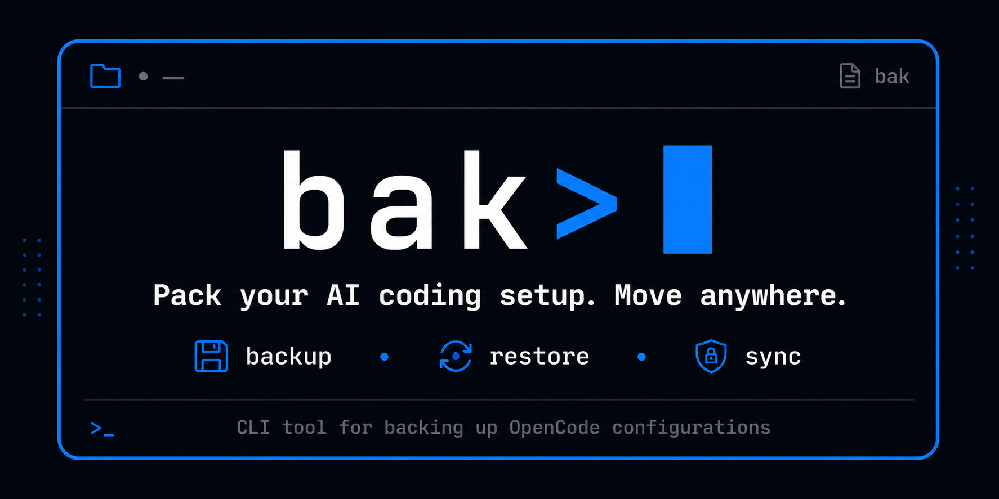
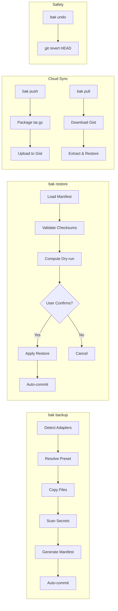
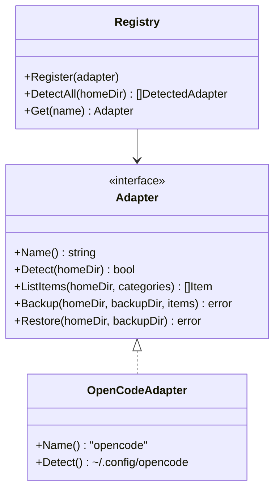

<p align="center">
  
</p>

<p align="center">
  <a href="https://goreportcard.com/report/github.com/danielxxomg/bak-cli"></a>
  <a href="https://opensource.org/licenses/MIT"></a>
  <a href="https://github.com/danielxxomg/bak-cli/releases/latest"></a>
  
  
  
</p>

<p align="center">
  <strong>bak</strong> is a CLI tool that backs up, restores, and syncs your AI coding configuration across machines. Supports Claude Code, Cursor, Codex, Windsurf, Kiro, KiloCode, pi.dev, and OpenCode. Never lose your skills, MCP servers, plugins, agents, or config files again.
</p>

## Supported Platforms

| Platform | Install Method | Package Format |
|----------|---------------|----------------|
| macOS (arm64, amd64) | Homebrew, Go | `brew install --cask`, `go install` |
| Linux (arm64, amd64) | Homebrew, .deb, .rpm, Go | `brew install --cask`, `.deb`, `.rpm`, `go install` |
| Windows (arm64, amd64) | Scoop, Go | `scoop install`, `go install` |

## Features

- 🤖 **Multi-Agent Support** — Auto-detects 8 AI coding tools: Claude Code, Cursor, Codex, Windsurf, Kiro, KiloCode, pi.dev, and OpenCode
- 🔄 **Backup & Restore** — Preset-based backups (quick, full, skills) with mandatory dry-run before restore
- 🔒 **Secret Detection** — Automatically excludes API keys, tokens, and generates `.env.example` templates
- ☁️ **Multi-Cloud Sync** — Push/pull backups to GitHub Gist, GitHub Repo, Codeberg, Gitea/Forgejo, and rclone (Google Drive, S3, etc.)
- 🔐 **Encryption at Rest** — AES-256-GCM encryption with Argon2id key derivation; opt-in per profile
- 👤 **Machine Profiles** — `bak profile` commands to scope backups per machine with independent adapter, category, preset, provider, and encryption settings
- 🖥️ **Cross-Platform** — Works on Windows, macOS, and Linux with path normalization
- 🎯 **Interactive Picker** — TUI with bubbletea for selective category backup
- ↩️ **Undo** — Git-backed safety with `bak undo` (git revert)
- 📦 **Export** — Export backups as portable tar.gz archives

## Why bak?

There are many dotfile managers. **bak** is not one of them — it's purpose-built for AI coding setups, with features generic tools don't cover.

| Feature | bak | chezmoi | mackup | stow |
|---------|-----|---------|--------|------|
| AI agent auto-detection (8 agents) | ✅ | ❌ | ❌ | ❌ |
| Cloud sync (Gist, Codeberg, Gitea, rclone) | ✅ | ✅ (git) | ✅ (iCloud, etc.) | ❌ |
| Encryption at rest (AES-256-GCM) | ✅ | ❌ | ❌ | ❌ |
| Machine profiles | ✅ | ✅ (templates) | ❌ | ❌ |
| Secret detection (auto-exclude tokens) | ✅ | ❌ | ❌ | ❌ |
| Mandatory dry-run before restore | ✅ | ❌ | ❌ | ❌ |
| Git-backed undo | ✅ | ✅ (git) | ❌ | ❌ |
| YAML extensibility (presets, adapters) | ✅ | ❌ | ❌ | ❌ |

If you back up AI coding configs, bak is the only tool that auto-detects your agents, encrypts your data, and syncs across clouds — all with safety guarantees built in.

## Installation

### macOS / Linux (Recommended)

```bash
brew install --cask danielxxomg/tap/bak
```

### Windows (Recommended)

```bash
scoop bucket add danielxxomg https://github.com/danielxxomg/bak-cli-tap
scoop install bak
```

<details>
<summary>Alternative install methods</summary>

### Debian/Ubuntu

Download the `.deb` file from [GitHub Releases](https://github.com/danielxxomg/bak-cli/releases) and install:

```bash
sudo dpkg -i bak_*.deb
```

### RHEL/Fedora

Download the `.rpm` file from [GitHub Releases](https://github.com/danielxxomg/bak-cli/releases) and install:

```bash
sudo rpm -i bak-*.rpm
```

### Go

```bash
go install github.com/danielxxomg/bak-cli@latest
```

### From Source

```bash
git clone https://github.com/danielxxomg/bak-cli.git
cd bak-cli
go build -o bak .
```

</details>

## Quick Start

```bash
# Create a backup
bak backup

# Create a backup scoped to a machine profile
bak profile create work --provider github-gist --preset full --encrypt
bak backup --profile work

# Preview what would be restored
bak restore --dry-run 20260604-150405

# Restore a backup
bak restore 20260604-150405

# Undo the last restore
bak undo

# Sync to cloud (GitHub Gist, Codeberg, Gitea, rclone, etc.)
bak login
bak push --provider github-gist
bak pull

# Verify backup integrity
bak verify 20260604-150405
bak verify --verbose 20260604-150405

# Compare two backups
bak diff 20260604-150405 20260605-080000
```

## Commands

| Command | Description |
|---------|-------------|
| `bak backup [--preset quick\|full\|skills] [--profile <name>]` | Create a backup |
| `bak restore [--dry-run] [--force] <id>` | Restore a backup |
| `bak undo` | Revert the last operation |
| `bak list [--provider <name>]` | List local or cloud backups |
| `bak pick` | Interactive TUI picker |
| `bak push [id] [--provider <name>] [--profile <name>]` | Push to a cloud backend |
| `bak pull [id] [--provider <name>] [--profile <name>]` | Pull from a cloud backend |
| `bak export <id> [--output path]` | Export as tar.gz |
| `bak login [--provider <name>]` | Authenticate with a cloud provider |
| `bak profile create\|list\|show\|delete` | Manage machine profiles |
| `bak verify [--verbose] <id>` | Verify backup integrity |
| `bak diff <id1> <id2>` | Show file-level differences between two backups |
| `bak version` | Show version info |
| `bak schedule create\|list\|remove` | Manage OS-native backup schedules |
| `bak wizard` | Launch the interactive profile/backup wizard |

## Configuration

### Storage Location

Backups are stored in `~/.bak/backups/<id>/`:

```
~/.bak/
├── config.json          # bak configuration
└── backups/
    └── 20260604-150405/
        ├── manifest.json
        ├── .env.example
        └── opencode/
            ├── skills/
            ├── commands/
            ├── plugins/
            └── config files...
```

### GitHub Token

For cloud sync, configure a GitHub token:

```bash
# Option 1: Interactive (GitHub only)
bak login

# Option 2: Environment variable
export GITHUB_TOKEN=ghp_xxxxxxxxxxxx

# Option 3: Config file
bak config set github.token ghp_xxxxxxxxxxxx
```

### Cloud Providers

Use `--provider` to select a cloud backend for push/pull/list:

| Provider | Flag | Config Key | Env Token |
|----------|------|------------|-----------|
| GitHub Gist | `github-gist` (default) | `providers.github.token` | `GITHUB_TOKEN` |
| GitHub Repo | `github-repo` | `providers.github.token` + `.repo` | `GITHUB_TOKEN` |
| Codeberg | `codeberg` | `providers.codeberg.token` + `.repo` | `CODEBERG_TOKEN` |
| Gitea / Forgejo | `gitea` | `providers.gitea.token` + `.repo` + `.base_url` | `GITEA_TOKEN` |
| Rclone | `rclone` | `providers.rclone.remote` | — |

```bash
# Push to a specific provider
bak push --provider codeberg

# List cloud backups
bak list --provider github-gist

# Configure non-GitHub providers
bak config set providers.codeberg.token <your-token>
bak config set providers.codeberg.repo owner/backups
```

### Machine Profiles

Profiles let you scope backups to specific machines with independent settings
for adapters, categories, preset, provider, and encryption.

```bash
# Create a profile for your work laptop
bak profile create work-laptop --provider github-gist --preset full --encrypt

# Create a lightweight profile for your home PC
bak profile create home-pc --provider github-repo --preset quick

# Create a profile that only backs up OpenCode and Cursor config
bak profile create dev-box --provider codeberg --adapters opencode,cursor --categories config,skills

# List all profiles
bak profile list

# Show full profile details
bak profile show work-laptop

# Delete a profile
bak profile delete old-machine
```

Use a profile with `--profile` on `backup`, `push`, or `pull`:

```bash
bak backup --profile work-laptop
bak push --profile work-laptop
bak pull --profile work-laptop
```

When `--profile` is set, its preset, categories, and adapter list override
the equivalent CLI flags.

### Custom Presets

You can define custom backup presets as YAML files under
`~/.config/bak/presets/`. Each file defines a preset with a name and
category list.

**Example** (`~/.config/bak/presets/my-full.yaml`):

```yaml
name: my-full
categories:
  - config
  - skills
  - commands
  - plugins
  - agents

metadata:
  description: "Custom full preset without MCP servers"
  author: "you"
```

If a custom preset has the same name as a built-in (quick, full, skills),
use `--override` to prefer the custom version:

```bash
bak backup --preset full --override
```

Without `--override`, name conflicts produce an error so you don't
accidentally replace built-in behavior.

Custom presets are merged with built-ins: any preset name not matching
a built-in is treated as a custom preset loaded from YAML.

### Custom Adapters

You can register adapters for new tools without writing Go code by
placing YAML declarations in `~/.config/bak/adapters/`.

**Example** (`~/.config/bak/adapters/myapp.yaml`):

```yaml
name: myapp
config_path: .config/myapp

categories:
  - name: config
    root_files:
      - config.yaml
      - settings.json

  - name: skills
    sub_path: skills
    is_dir: true

  - name: commands
    sub_path: commands
    is_dir: true
```

`bak backup` will auto-detect your custom adapter if the `config_path`
directory exists under your home directory. Use `--adapter myapp` to
force it.

Custom adapters that share a name with a built-in adapter require
`--override` to replace the built-in:

```bash
bak backup --adapter opencode --override
```

See `examples/presets/` and `examples/adapters/` for annotated samples.

### Backup Scheduling

Schedule automatic backups using OS-native task schedulers (crontab on
Linux/macOS, schtasks on Windows).

```bash
# Create a daily scheduled backup for a profile
bak schedule create work --every daily

# List all active bak-cli schedules
bak schedule list

# Remove a schedule
bak schedule remove work
```

Supported intervals: `daily`, `weekly`, `every-12h`, `every-6h`.

Each schedule runs `bak backup --profile <name> && bak push --profile <name>`
at the configured interval.

### Interactive Wizard

Use `--interactive` on `profile create` or `login` to launch a step-by-step
TUI wizard powered by [Bubble Tea](https://github.com/charmbracelet/bubbletea).

```bash
# Create a profile interactively (no flags needed)
bak profile create my-machine --interactive

# Login with provider selection wizard
bak login --interactive
```

The wizard walks through provider selection, preset choice, adapter toggling,
and category selection with keyboard navigation.

### Encryption

Encryption is enabled per profile with the `--encrypt` flag on `bak profile create`.
Encrypted archives use **AES-256-GCM** with **Argon2id** key derivation (64 MB RAM,
3 iterations, 4 parallelism).

| Feature | Detail |
|---------|--------|
| Algorithm | AES-256-GCM |
| Key derivation | Argon2id (64 MB, 3 iter, 4 parallel) |
| Magic bytes | `BAK_ENC\x01` — instant detection without parsing |
| Password input | Interactive prompt (stdin) or `BAK_ENCRYPTION_PASSWORD` env var |
| Backward compat | Plaintext archives from v0.2.0 are detected and handled automatically |

**Push flow**: `bak push --profile work` encrypts the tar.gz archive before upload.
**Pull flow**: `bak pull` detects magic bytes, prompts for password, decrypts on the fly.

```bash
# Set password via environment variable (CI/scripts)
export BAK_ENCRYPTION_PASSWORD="your-secure-password"
bak push --profile work

# Or use interactive prompt (no env var set)
bak push --profile work
# → Enter encryption password: ********
```

Encryption metadata (algorithm, KDF, salt, nonce) is stored in the backup manifest
for auditability. The password itself is never persisted to disk.

### Supported AI Coding Agents

`bak backup` auto-detects installed agents in priority order:

| Agent | Path | Priority |
|-------|------|----------|
| Claude Code | `~/.claude/` | 1 |
| Cursor | `~/.cursor/` | 2 |
| Codex | `~/.codex/` | 3 |
| Windsurf | `~/.codeium/windsurf/` | 4 |
| Kiro | `~/.kiro/` | 5 |
| KiloCode | `~/.kilocode/` | 6 |
| pi.dev | `~/.pi/` | 7 |
| OpenCode | `~/.config/opencode/` | 8 |

Force a specific adapter:
```bash
bak backup --adapter cursor
```

## Architecture

```
bak-cli/
├── cmd/                    # CLI commands (cobra)
├── internal/
│   ├── adapters/           # Agent adapters (8 supported: Claude Code, Cursor, Codex,
│   │   │                   #   Windsurf, Kiro, KiloCode, pi.dev, OpenCode)
│   │   └── register/       # RegisterAll() wire-up
│   ├── backup/             # Backup engine + presets + secrets
│   ├── restore/            # Restore engine + dry-run + git safety
│   ├── manifest/           # Manifest schema + validation
│   ├── cloud/              # Cloud provider abstraction (GitHub Gist, GitHub Repo,
│   │                       #   Codeberg, Gitea/Forgejo, Rclone)
│   ├── crypto/             # AES-256-GCM encryption + Argon2id key derivation
│   ├── paths/              # Cross-platform path normalization
│   ├── git/                # Git operations (go-git)
│   ├── config/             # Configuration management + v0.1.0 → v0.3.0 migration
│   ├── presets/            # Preset definitions
│   └── schedule/           # OS-native task scheduling (crontab / schtasks)
├── .goreleaser.yaml        # Cross-platform release config
└── Taskfile.yml             # Development workflow targets
```

### Data Flow



### Adapter Pattern



## Safety Guarantees

- ✅ **Mandatory dry-run** — Always preview changes before restore
- ✅ **Git-backed safety** — Auto-commit before/after restore
- ✅ **Instant rollback** — `bak undo` reverts in one command
- ✅ **Secret exclusion** — API keys/tokens never backed up
- ✅ **Path validation** — Prevents path traversal attacks
- ✅ **Checksum verification** — SHA-256 integrity checks

## Contributing

Contributions welcome! See [CONTRIBUTING.md](CONTRIBUTING.md) for development setup, code style, adapter implementation guide, and PR process.

Quick start: fork → branch → commit (conventional commits) → push → PR.

## Next Steps

- **Interactive setup?** Run `bak wizard` for a step-by-step TUI setup.
- **Automated backups?** Set up a [schedule](#backup-scheduling) with `bak schedule create`.
- **Custom backup presets?** Add YAML files to `~/.config/bak/presets/`. See [Custom Presets](#custom-presets).
- **Support a new tool?** Register a [custom adapter](#custom-adapters) in `~/.config/bak/adapters/`.

## Roadmap

### Completed ✅
- v1.3.0 — Multi-OS package manager support (Homebrew, Scoop, deb, rpm)
- v1.2.x — DI refactor, CI hardening, test coverage bump
- v1.1.0 — QA stack (Taskfile, golangci-lint, E2E, fuzz, benchmarks)
- v1.0.0 — Stable release (8 adapters, 5 cloud backends, encryption, profiles)
- v0.3.0 — Encryption at rest + machine profiles
- v0.2.0 — Multi-agent + cloud backends

### Future
- [ ] homebrew-core submission
- [ ] scoop-extras submission
- [ ] winget, AUR, nix support
- [ ] Plugin system for custom backup strategies

<details>
<summary>Brand Assets</summary>

Visual assets are in `docs/brand/`:

| Asset | File | Usage |
|-------|------|-------|
| Wordmark (color) | `logo/bak-wordmark-color.png` | Primary brand mark |
| Wordmark (mono) | `logo/bak-wordmark-mono-white.png` | Dark backgrounds, print |
| GitHub Banner | `banner/bak-github-banner.png` | Social preview, README |
| Icon (geometric) | `icon-secondary/bak-icon-geometric.png` | Official icon, favicons |
| Icon (friendly) | `icon-secondary/bak-icon-friendly.png` | Stickers, swag, presentations |
| Favicon 32px | `favicon/bak-favicon-32.png` | Browser tab, small icon |
| Favicon 16px | `favicon/bak-favicon-16.png` | Browser tab (tiny) |

</details>

## License

MIT License — see [LICENSE](LICENSE) for details.
