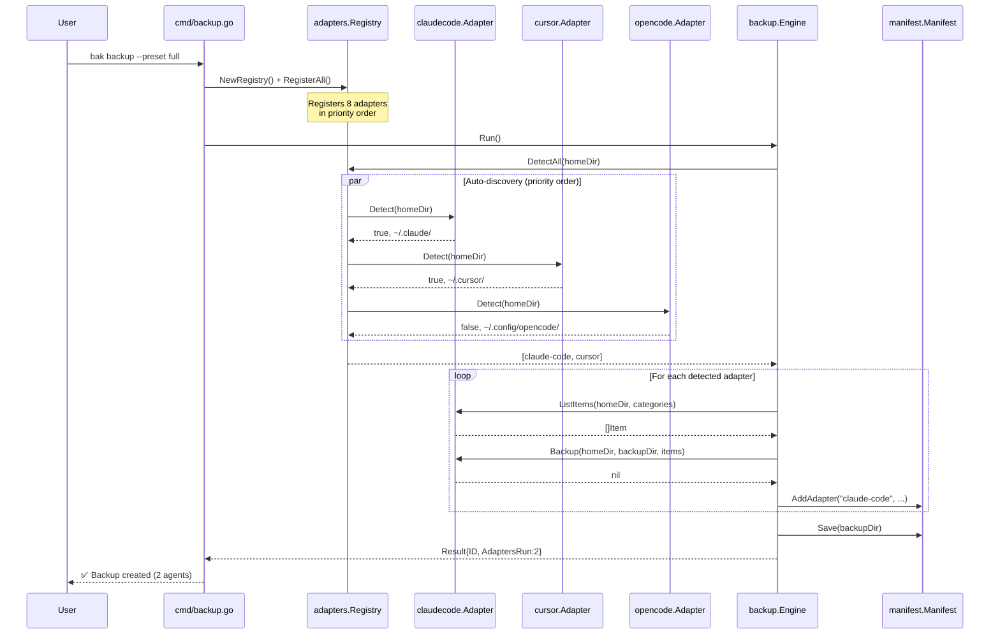
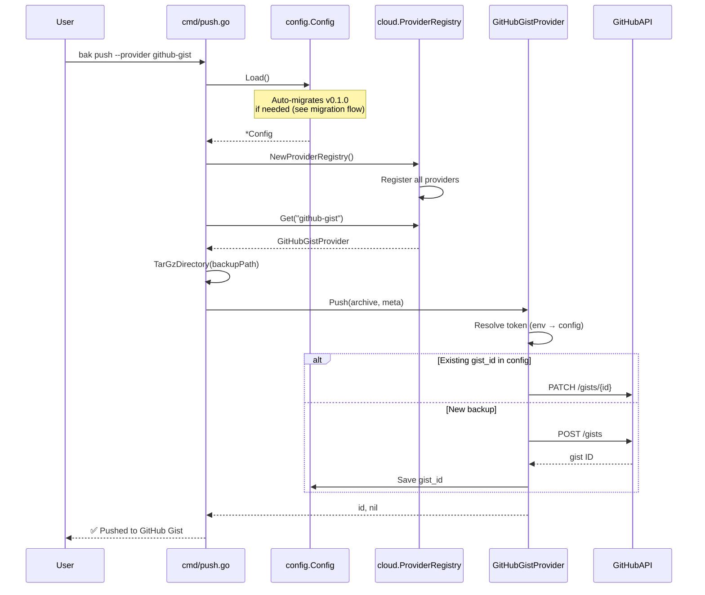
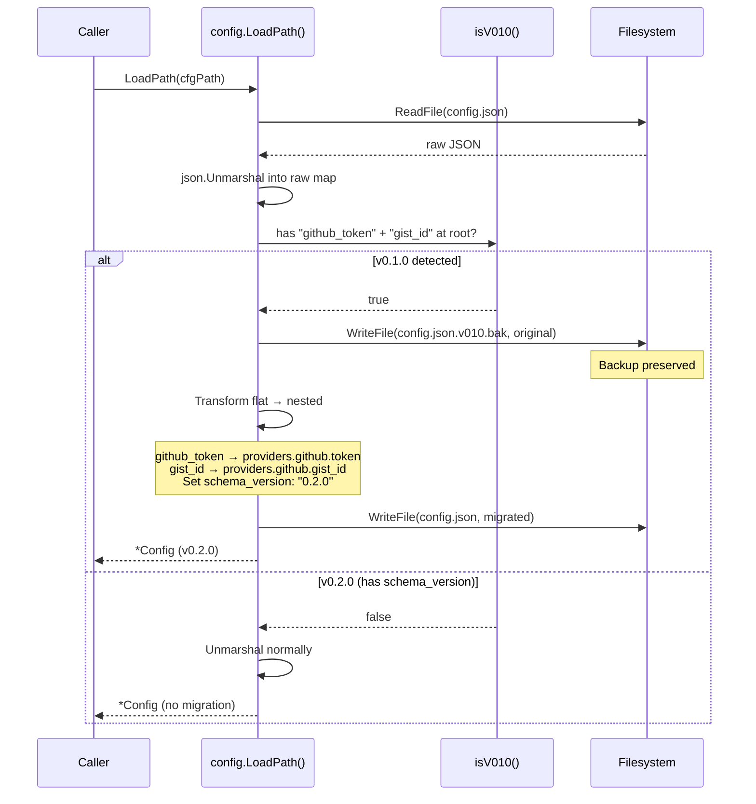

# Design: v0.2.0 — Multi-Agent Adapters & Cloud Backend Abstraction

## Technical Approach

Introduce a `Provider` interface in `internal/cloud/` to decouple push/pull from GitHub Gist, mirroring the existing `Adapter` interface pattern. Add 7 agent adapter sub-packages under `internal/adapters/` following the `opencode/` template. Refactor `config.Config` to a nested multi-backend schema with auto-migration from v0.1.0 flat format on `Load()`. Existing Gist code becomes `GitHubGistProvider` — the default — preserving full backward compatibility.

## Architecture Decisions

| # | Decision | Options | Tradeoff | Choice | Rationale |
|---|----------|---------|----------|--------|-----------|
| D1 | Provider interface shape | (a) Push/Pull/List only (b) +Open/+Auth | (a) minimal, (b) flexible but over-engineered | (a) | Matches spec exactly; auth stays per-provider via constructor. Avoids interface bloat. |
| D2 | Provider registration | (a) Global map (b) Registry struct | (a) simple but untestable, (b) mirrors Adapter Registry | (b) | Codebase already uses `adapters.Registry` pattern — consistency wins. |
| D3 | Adapter detection order | (a) Registration order (b) Explicit priority slice | (a) implicit, (b) explicit & testable | (b) | Spec requires fixed priority: Claude Code → Cursor → Codex → Windsurf → Kiro → KiloCode → pi.dev → OpenCode. |
| D4 | Config migration strategy | (a) In-place rewrite (b) Write new + keep .bak | (a) risky, (b) safe with rollback | (b) | Spec mandates `.v010.bak` preservation. Write new file, keep backup. |
| D5 | Adapter package structure | (a) Single file per adapter (b) Sub-package per adapter | (a) flat, (b) isolated like opencode/ | (b) | Follows existing `opencode/` pattern. Each adapter owns its config paths, categories, tests. |
| D6 | Manifest schema version | (a) Bump to 0.2.0 (b) Keep 0.1.0 | (a) explicit, (b) backward compat free | (b) | `map[string]AdapterManifest` already supports multi-agent. No schema change needed. |

## Data Flow

### Provider Selection Flow

```
cmd/push.go
  │
  ├─ config.Load() ──→ auto-migrate v0.1.0 if needed
  │
  ├─ cloud.NewProviderRegistry()
  │    ├─ Register("github-gist", GitHubGistProvider)   ← default
  │    ├─ Register("github-repo", GitHubRepoProvider)
  │    ├─ Register("codeberg",    CodebergProvider)
  │    ├─ Register("rclone",      RcloneProvider)
  │    └─ Register("gitea",       GiteaProvider)
  │
  ├─ --provider flag ──→ registry.Get(name)
  │    └─ (empty) ──→ registry.Get("github-gist")  ← default
  │
  └─ provider.Push(archive, meta)
```

### Multi-Agent Backup Flow

```
cmd/backup.go
  │
  ├─ adapters.NewRegistry()
  │    └─ RegisterAll() ← registers all 8 adapters in priority order
  │
  ├─ registry.DetectAll(homeDir)
  │    ├─ claude-code: ~/.claude/ exists? → yes
  │    ├─ cursor: ~/.cursor/ exists? → yes
  │    ├─ opencode: ~/.config/opencode/ exists? → no → skip
  │    └─ ... (others checked)
  │
  ├─ engine.Run()
  │    └─ for each detected adapter:
  │         ├─ ListItems(homeDir, categories)
  │         ├─ Backup(homeDir, backupDir, items)
  │         └─ manifest.AddAdapter(name, ...)
  │
  └─ manifest.Save(backupDir)
```

## File Changes

| File | Action | Description |
|------|--------|-------------|
| `internal/cloud/provider.go` | Create | `Provider` interface + `ProviderRegistry` struct |
| `internal/cloud/github_gist.go` | Create | `GitHubGistProvider` — wraps existing gist.go functions |
| `internal/cloud/github_repo.go` | Create | `GitHubRepoProvider` — pushes to GitHub repo via Git API |
| `internal/cloud/codeberg.go` | Create | `CodebergProvider` — Codeberg API (Gitea-compatible) |
| `internal/cloud/rclone.go` | Create | `RcloneProvider` — shells out to `rclone` binary |
| `internal/cloud/gitea.go` | Create | `GiteaProvider` — self-hosted Gitea/Forgejo |
| `internal/cloud/gist.go` | Modify | Keep low-level API funcs; `github_gist.go` wraps them |
| `internal/config/config.go` | Modify | Add `SchemaVersion`, `Providers` nested struct; migration in `LoadPath()` |
| `internal/adapters/registry.go` | Modify | Add `RegisterAll()` with priority-ordered adapter list |
| `internal/adapters/claudecode/adapter.go` | Create | Claude Code adapter (`~/.claude/`) |
| `internal/adapters/cursor/adapter.go` | Create | Cursor adapter (`~/.cursor/`) |
| `internal/adapters/codex/adapter.go` | Create | Codex adapter (`~/.codex/`) |
| `internal/adapters/windsurf/adapter.go` | Create | Windsurf adapter (`~/.codeium/windsurf/`) |
| `internal/adapters/kiro/adapter.go` | Create | Kiro adapter (`~/.kiro/`) |
| `internal/adapters/kilocode/adapter.go` | Create | KiloCode adapter (`~/.kilocode/`) |
| `internal/adapters/pidev/adapter.go` | Create | pi.dev adapter (`~/.pi/`) |
| `cmd/push.go` | Modify | Use `ProviderRegistry` + `--provider` flag instead of direct Gist calls |
| `cmd/pull.go` | Modify | Use `ProviderRegistry` + `--provider` flag instead of direct Gist calls |
| `cmd/login.go` | Modify | Multi-provider auth: `bak login --provider codeberg` |
| `cmd/backup.go` | Modify | Call `reg.RegisterAll()` instead of manual opencode registration |

## Interfaces / Contracts

### Provider Interface

```go
// internal/cloud/provider.go

// Provider abstracts cloud backup storage backends.
type Provider interface {
    // Name returns the provider identifier (e.g., "github-gist", "codeberg").
    Name() string

    // Push uploads a backup archive to the cloud backend.
    // Returns a provider-specific backup ID for later retrieval.
    Push(archive []byte, meta PushMeta) (id string, err error)

    // Pull downloads a backup archive by its provider-specific ID.
    Pull(id string) (archive []byte, err error)

    // List returns metadata for all backups stored by this provider,
    // in reverse chronological order (newest first).
    List() ([]BackupMeta, error)
}

// PushMeta carries context for a push operation.
type PushMeta struct {
    BackupID  string    // local backup ID (timestamp)
    CreatedAt time.Time
    Hostname  string
    OS        string
    Agents    []string  // adapter names included
}

// BackupMeta describes a stored backup without its content.
type BackupMeta struct {
    ID        string    // provider-specific ID
    BackupID  string    // original local backup ID
    CreatedAt time.Time
    Hostname  string
    Size      int64
    URL       string    // human-readable link (gist URL, repo URL, etc.)
}

// ProviderRegistry routes commands to named providers.
type ProviderRegistry struct {
    providers map[string]Provider
    defaultName string
}

func NewProviderRegistry() *ProviderRegistry { ... }
func (r *ProviderRegistry) Register(p Provider) error { ... }
func (r *ProviderRegistry) Get(name string) (Provider, error) { ... }
func (r *ProviderRegistry) SetDefault(name string) { ... }
```

### Config v0.2.0 Schema

```go
// internal/config/config.go

type Config struct {
    SchemaVersion string              `json:"schema_version"`
    Providers     map[string]ProviderConfig `json:"providers,omitempty"`
    path          string              `json:"-"`
}

type ProviderConfig struct {
    Token   string `json:"token,omitempty"`
    GistID  string `json:"gist_id,omitempty"`   // github-gist only
    Repo    string `json:"repo,omitempty"`       // github-repo, codeberg, gitea
    Remote  string `json:"remote,omitempty"`     // rclone remote name
    BaseURL string `json:"base_url,omitempty"`   // gitea/forgejo custom URL
}
```

### Adapter Detection Paths

| Agent | Name | Config Path (relative to home) | Priority |
|-------|------|-------------------------------|----------|
| Claude Code | `claude-code` | `.claude/` | 1 |
| Cursor | `cursor` | `.cursor/` | 2 |
| Codex | `codex` | `.codex/` | 3 |
| Windsurf | `windsurf` | `.codeium/windsurf/` | 4 |
| Kiro | `kiro` | `.kiro/` | 5 |
| KiloCode | `kilocode` | `.kilocode/` | 6 |
| pi.dev | `pidev` | `.pi/` | 7 |
| OpenCode | `opencode` | `.config/opencode/` | 8 |

## Sequence Diagrams

### Backup with Multi-Agent Discovery



### Push with Provider Selection



### Config Migration (v0.1.0 → v0.2.0)



## Testing Strategy

| Layer | What to Test | Approach |
|-------|-------------|----------|
| Unit | Provider interface contract per implementation | Table-driven tests with `httptest.Server` mocks per provider |
| Unit | Config migration: v0.1.0 → v0.2.0 round-trip | `t.TempDir()` with fixture JSON files; verify `.v010.bak` created |
| Unit | Adapter detection with fake home dirs | `t.TempDir()` creating/not creating config dirs |
| Unit | Provider registry: unknown provider error | Direct unit test on `Get("unknown")` |
| Integration | Push/pull round-trip per provider | `httptest.Server` simulating GitHub/Codeberg API |
| Integration | Config migration idempotency | Load → Save → Load again; verify no duplicate `.bak` |
| Integration | Multi-agent backup with 3 fake adapters | Register mock adapters, verify manifest contains all 3 |

## Migration / Rollout

1. **Config auto-migration**: `config.LoadPath()` detects v0.1.0 by presence of `github_token` + `gist_id` at root level AND absence of `schema_version`. Writes `config.json.v010.bak` before overwriting.
2. **Provider default**: `github-gist` remains default. Users with existing v0.1.0 config get seamless migration — their token and gist_id move to `providers.github.*`.
3. **Adapter backward compat**: Manifest schema stays at `0.1.0`. v0.1.0 backups contain only `"opencode"` key in `adapters` map — restore engine routes to opencode adapter as before.
4. **No feature flags**: All changes are additive. New adapters/providers are opt-in via auto-discovery and `--provider` flag respectively.

## Open Questions

- [ ] Should `rclone` provider shell out to `rclone` binary or implement rclone RC protocol? (Proposal says exec — leaning exec for simplicity)
- [ ] Codeberg and Gitea share the same API — should `CodebergProvider` embed `GiteaProvider` with a fixed base URL, or be a separate implementation?
- [ ] Should `bak login` support `--provider` flag for non-GitHub providers (Codeberg token, Gitea token), or defer to `bak config set`?
